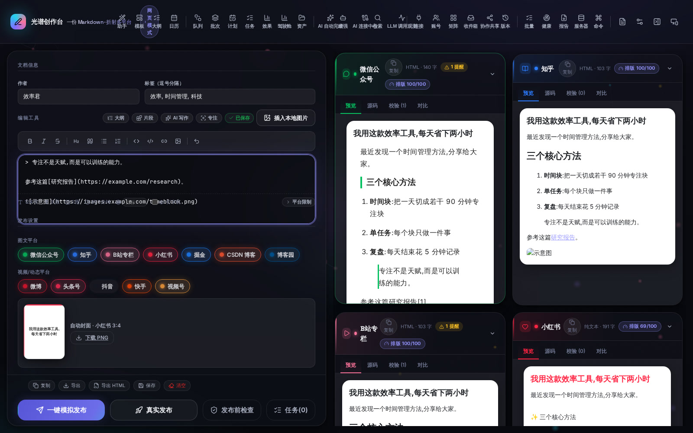
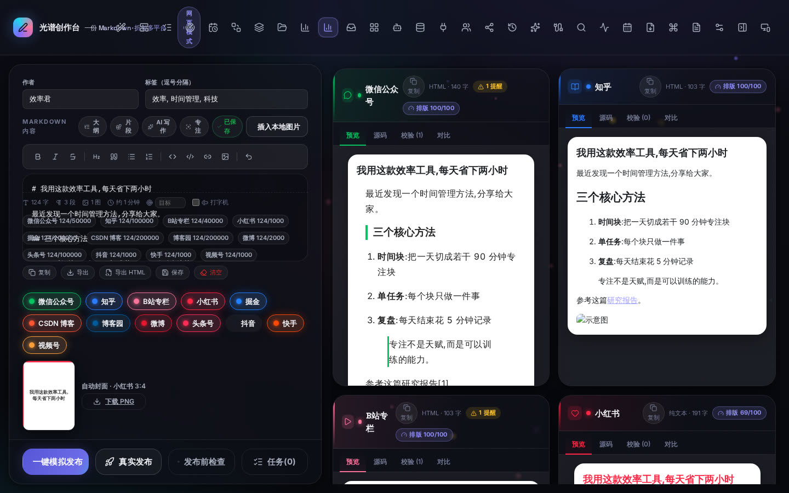

# 多平台内容发布工具

> 一份 Markdown，自动适配 **微信公众号 / 知乎 / B站专栏 / 小红书 / 掘金 / 博客园 / CSDN 博客 / 微博 / 头条号 / 抖音 / 快手 / 视频号** 的格式与风格，一键发布（默认模拟）。

创作者把同一篇内容同步到多个平台时，逐个适配格式极其耗时：公众号过滤 `class`/外链、知乎公式要转图片、B站图片防盗链、小红书只认纯文本+话题标签且必须配图。本工具用**规范化中间表示（IR）+ 能力声明式适配器**，让你写一次内容，自动产出**十二个平台**的合规产物，并保留**零改核心扩展更多平台**的架构。

---

## ✨ 核心亮点

| 🚀 **一键多平台** | 🤖 **AI 全流程增强** | 🔒 **安全可控** |
|---|---|---|
| 一份 Markdown 自动适配 12 个平台 | AI 标题/摘要/改写/排期/复盘 | 密钥不落盘、SSRF 防护、幂等发布 |
| **零密钥即可全功能演示** | **LLM 不可用自动规则兜底** | **1700+ 测试守护** |

## 📑 目录

- [界面速览](#界面速览)
- [快速上手](#快速上手)
- [核心亮点](#-核心亮点)
- [架构总览](#架构总览)
- [关键设计](#关键设计能力声明式适配器)
- [桌面端](#桌面端tauri-2--摆脱浏览器启动)
- [沉浸式创作体验](#沉浸式创作体验awwwards-级-ui)
- [发布能力](#一键发布与辅助发布)
- [安全边界](#安全边界公众号真实发布)
- [测试与验证](#测试与验证)
- [目录结构](#目录结构)

---

## 界面速览

> 以下为项目**真实运行界面**截图（`npm run dev` 启动的 Web 工具，浏览器实测截图）。

<div align="center">
  <table>
    <tr>
      <td align="center" width="50%">
        
        <br/><sub><b>主编辑器</b>：Markdown 输入 + 实时多平台预览 + 排版评分</sub>
      </td>
      <td align="center" width="50%">
        
        <br/><sub><b>设置面板</b>：AI 配置 / 服务地址 / 发布模式管理</sub>
      </td>
    </tr>
    <tr>
      <td align="center" width="50%">
        
        <br/><sub><b>运营驾驶舱</b>：发布概览 / 效果趋势 / 目标进度</sub>
      </td>
      <td align="center" width="50%">
        
        <br/><sub><b>内容日历</b>：全链路发布时间轴</sub>
      </td>
    </tr>
    <tr>
      <td align="center" width="50%">
        
        <br/><sub><b>发布队列</b>：稍后发布 / 定时发布</sub>
      </td>
      <td align="center" width="50%">
        
        <br/><sub><b>内容资产库</b>：封面 / 图床 / 产物统一检索</sub>
      </td>
    </tr>
  </table>
</div>

## 快速上手

```bash
npm install

# 零密钥闭环演示:样例 MD → 六平台产物落盘 dist/demo/(含本地图上传图床演示)
npm run demo

# 交互式 Web 工具(主演示路径,无需扩展/密钥)
npm run dev          # 打开 http://localhost:5176

# 桌面端(Tauri 2)本地开发 —— 摆脱浏览器启动
# 前置:安装 Rust 工具链 + Linux 需 webkit2gtk-4.1(见「桌面端」章节)
npm run desktop      # 启动原生桌面窗口(内置 xterm.js 终端)

# 全量单测(360+) + 类型检查 + 代码风格
npm test
npm run typecheck
npm run lint
npm run test:coverage   # core 覆盖率门槛 ≥80%

# 打包 MV3 浏览器扩展 → dist-ext/(Chrome 加载已解压扩展)
npm run build:ext

# 打包桌面端安装包(deb/rpm/AppImage/msi/dmg) → packages/desktop/src-tauri/target/release/bundle
npm run desktop:build

# 可选服务端(图片图床 / 公众号真实发布时需要,默认不启)
npm run server       # 需先在 packages/server 配置 .env

# 可选 Playwright runner(知乎/B站/小红书/掘金/CSDN 网页端真实分发)
npm run runner       # http://127.0.0.1:8790，仅使用本机浏览器登录态
```

`npm run demo` 后查看 `dist/demo/`：`wechat.html`（内联样式、无 class/外链图）、`zhihu.html`（公式图片+保留外链）、`bilibili.html`（受限 HTML+分区）、`xiaohongshu.txt`（纯文本+#话题#+违禁词替换）、`juejin.md`（原生 Markdown）、`csdn.md`（原生 Markdown）、各平台 `*-cover.svg` 封面、`report.json`（校验与回执详情）。

---

## 架构总览

monorepo（npm workspaces），三包 + 演示脚本：

| 包 | 职责 | 依赖环境 |
|---|---|---|
| **packages/core** | 纯 TS、零 DOM。IR 类型、MD→IR 解析、能力驱动变换库、适配器注册表+十二平台适配器、HTML 净化、配置外置、图片重托管、校验器、两阶段 Publisher、同步引擎、OpenAI 兼容 LLM | 无（可被 app/server 共用） |
| **packages/app** | 一套 React UI **三构建**：`dev` 即完整 Web 工具，`build:ext` 即 MV3 扩展，桌面端复用同一套 UI。通过 `PlatformBridge` 隔离 `chrome.*`/Tauri，含草稿持久化 / 图片上传 / AI 增强面板 / 内置 xterm.js 终端 | 浏览器 / Tauri WebView |
| **packages/desktop** | Tauri 2 桌面壳（Rust）：承载原生窗口，摆脱浏览器启动；经 `portable-pty` 在应用内启动 server/runner 等本地子进程并把输出流推给 xterm.js | Rust + 系统 WebView |
| **packages/server** | 可选 Fastify 服务端，默认不启。持公众号密钥、跑 token 缓存、图片图床（local/s3/wechat）、限流 + 结构化日志 | Node 20+ |
| **packages/runner** | 可选 Playwright 本机自动化 runner。复用用户本机浏览器登录态，打开真实创作者中心，填写内容并可在显式开启后点击发布 | Node 20+ / Chromium |

### 核心数据流

```
Markdown
  → IR Document (AST + 元数据 + 资产表)        ← 核心永不持有平台 HTML
  → 每平台:
      preprocess(能力驱动降级管线)  IR → IR     ← 纯函数变换,按缺失能力选择
      serialize(平台原生格式)       IR → 产物    ← 公众号内联HTML/知乎富文本/B站受限HTML/小红书纯文本/掘金·博客园·CSDN·头条Markdown/微博·抖音·快手·视频号纯文本
      validate(按 capabilities)                ← 长度/必须图/违禁词
      Publisher.stage() → 暂存产物
      Publisher.confirm() → 回执
```

### 关键设计：能力声明式适配器

每个平台只**声明它缺什么能力**，变换管线据此自动降级，核心**绝无 `switch(platform)`**：

| 平台 | contentModel | 外链 | 表格 | 公式 | 必须封面 | 字数计数 | 违禁词过滤 |
|---|---|---|---|---|---|---|---|
| 微信公众号 | `inline-html` | ❌→脚注 | ✅ | ❌ | 否 | 普通 | 否 |
| 知乎 | `rich-clipboard` | ✅ | ✅ | 图片(equation) | 否 | 普通 | 否 |
| B站专栏 | `restricted-html` | ✅ | ❌→图片 | 图片 | 否 | 普通 | 否 |
| 小红书 | `plaintext` | ❌→脚注 | ❌→图片 | ❌ | ✅ | **字素簇** | ✅ |
| 掘金 | `markdown` | ✅ | ✅ | 原生 LaTeX | 否 | **字素簇** | 否 |
| 博客园 | `markdown` | ✅ | ✅ | 原生 LaTeX | 否 | **字素簇** | 否 |
| CSDN 博客 | `markdown` | ✅ | ✅ | 原生 LaTeX | 否 | **字素簇** | 否 |
| 微博 | `plaintext` | ❌→文字 | ❌ | ❌ | 否 | **字素簇** | ✅ |
| 头条号 | `markdown` | ✅ | ✅ | 文字 | ✅ | **字素簇** | ✅ |
| 抖音 | `plaintext` | ❌→文字 | ❌ | ❌ | ✅ | **字素簇** | ✅ |
| 快手 | `plaintext` | ❌→文字 | ❌ | ❌ | ✅ | **字素簇** | ✅ |
| 视频号 | `plaintext` | ❌→文字 | ❌ | ❌ | ✅ | **字素簇** | ✅ |

> 小红书标题≤20/正文≤1000、微博≤2000、抖音/快手/视频号文案≤1000 用 `Intl.Segmenter` 按**字素簇**计数（emoji、组合字符算一个），而非 `string.length`。

---

## 桌面端（Tauri 2 · 摆脱浏览器启动）

`packages/desktop` 是 Tauri 2 桌面壳。它让本项目**不依赖用户手动打开浏览器**：原生窗口承载同一套 React UI，并内置一个 **xterm.js 终端**，可直接在应用内启动 `server` / `runner` 等本地服务。

### 技术栈

- **Tauri 2**：Rust 壳 + 系统 WebView，安装包小（MB 级）、内存占用低、启动快；`packages/app` 的 React 产物作为 `frontendDist` 被直接打包。
- **React**：沿用现有 `packages/app` 整套 UI，桌面/Web/扩展三端共用一套组件与 store。
- **xterm.js**：桌面端内置终端面板，支持 WebGL 硬件加速（自动回退）；输入经 Tauri IPC 写入 `portable-pty` 子进程，stdout/stderr 事件流回推到终端。

### 环境准备

```bash
# Rust 工具链
curl --proto '=https' --tlsv1.2 -sSf https://sh.rustup.rs | sh

# Linux 额外需要系统 WebKit 与图标库
sudo apt install libwebkit2gtk-4.1-dev build-essential curl wget file \
  libxdo-dev libssl-dev libayatana-appindicator3-dev librsvg2-dev

# Windows:安装 VS Build Tools(C++ 桌面负载)+ WebView2
# macOS:Xcode Command Line Tools
```

### 运行与打包

```bash
npm run desktop        # 本地开发:自动起 Vite 并打开原生窗口
npm run desktop:build  # 打包安装包 → packages/desktop/src-tauri/target/release/bundle
npm run desktop:icon   # 从 scripts/generate-app-icon.mjs 重新生成全尺寸图标
```

### 桌面端性能与安全

- **内置终端**：仅在桌面环境渲染，且经 `React.lazy` 按需加载 —— 浏览器/扩展主包**不包含** xterm 与 Tauri API（实测 Web 主 JS 从 1.12 MB 回落到 555 kB 并拆出 vendor 缓存友好的分包）。
- **预览 Worker**：`adapt-worker.ts` 把 Markdown→全平台适配从主线程搬到 Web Worker（桌面/Web 共用），配合 250ms 防抖 + 序号守卫，输入不卡顿。
- **命令白名单**：Rust 侧 `COMMANDS` 只放行 `server` / `runner`，不暴露任意 shell；前端只显示白名单服务。

---

## 沉浸式创作体验（Awwwards 级 UI）


<div align="center">
  
  <br/>
  <sub>折射光谱母题的创作画布：深空底 + 极光渐变 + 玻璃拟态预览卡</sub>
</div>


> 以「折射光谱」为视觉母题 —— 一份 Markdown 输入，经多个平台折射为不同的光谱呈现。浏览器即交互式艺术画布，同时尊重 `prefers-reduced-motion` 自动降级。

- **视觉系统**：深空画布 + 极光紫/青/粉/琥珀四重光谱渐变氛围，玻璃拟态卡片 + 细腻渐变描边，全局 SVG 噪点质感；Space Grotesk / Inter / JetBrains Mono 展示字体（桌面端 CSP 已放行 Google Fonts）。
- **沉浸组件**：`AuroraCanvas`（Canvas 实时极光粒子星网，鼠标斥力扰动）、`CursorGlow`（rAF 缓动全局辉光）、`IntroOverlay`（首屏光谱巨标题开场，支持点击 / 键盘 / 减弱动效跳过）。
- **交互细节**：按钮流光扫过、弹簧位移动画、卡片悬浮上浮、预览卡逐项浮现；六平台预览卡均带品牌色 Lucide 图标与发光点缀。
- **图标规范**：全界面统一 Lucide 图标，无任何表情符号。
- **测试**：`ui-immersive.spec.tsx`（开场动画 / 键盘 / reduced-motion / 极光画布 / 光标辉光 / 六平台图标映射）。

### 编辑器体验增强（2026-08-06）

- **Markdown 快捷工具栏**：编辑区上方常驻格式工具条 —— 加粗 / 斜体 / 删除线 / 标题 / 引用 / 无序·有序列表 / 行内代码 / 代码块 / 链接 / 图片 / 撤销（最多 50 步）。全部基于 textarea 选区做最小侵入编辑，纯函数语义（`markdown-edit.ts` 可单测）。
- **实时文档统计**：字数 / 段落数 / 图片数 / 预估阅读时长；并对每个已选平台展示「当前字数 / 上限」，接近 90% 或超限时自动高亮预警（小红书 1000 字等限制一目了然）。
- **自动保存状态指示器**：编辑区右上角常驻「已保存 / 保存中 / 未保存 / 保存失败」状态点，保存失败弹出 Toast 说明原因。
- **全局快捷键**：`Ctrl/Cmd+S` 立即保存草稿；`Ctrl/Cmd+Enter` 在编辑框内触发一键发布（不与其他抽屉输入冲突）。
- **轻量 Toast 反馈**：发布成功 / 部分成功 / 失败、导出导入结果、自动保存失败等操作均有非阻塞全局提示（3.5s 自动消失，可手动关闭）。
- **测试**：`markdown-edit.spec.ts`（11 例）+ `editor-ux.spec.tsx`（9 例）。

### 创作工作流增强（Roadmap v7 · 2026-08-07）

- **编辑器查找/替换（Ctrl/Cmd+F）**：编辑区唤起查找面板 —— 实时匹配计数（`当前/总数`）、上一个/下一个循环跳转（`Shift+Enter` / `Enter`）、**替换 / 全部替换**、**区分大小写 / 整词匹配 / 正则匹配** 开关（正则非法实时提示「正则错误」）；替换并入共享撤销栈，可一键撤销；纯函数 `find-replace.ts` 可单测。**v7 Phase 2 新增：正则匹配 + 当前匹配行高亮**（查找打开时编辑器以蓝色渐变高亮当前匹配所在行，与打字机行高亮同机制）。
- **发布前健康检查**：编辑器底部「发布前检查」按钮唤起体检抽屉 —— 跨平台统一检查**标题缺失 / 正文空与过短 / 图片缺 alt 与 dataURL / 极限词扫描 / 各平台校验 error**；输出整体状态（可以发布 / 存在阻塞问题）+ 平台汇总 + 问题清单 + 可执行建议；存在 error 时禁用发布。**v7 Phase 2 深化：真实发布前强制体检** —— 点击「真实发布」自动体检并弹出抽屉，体检通过后「确认真实发布」才执行；**计划任务 / 发布队列 / 发布批次** 到点发布前也做前置体检（error 级问题拒绝并如实记录）。
- **草稿切换自动保存加固**：新建/切换草稿前强制 flush 未保存修改（避免防抖窗口内丢内容）；编辑器有未保存内容时刷新/关闭页面弹出原生确认。
- **创作快捷操作条**：统计条下方常驻「复制 Markdown / 导出 .md / 立即保存 / 清空内容（二次确认）」四个高频操作，全部带 toast 反馈。**v7 Phase 2 扩展到桌面端托盘**：托盘菜单新增「复制 Markdown / 导出 .md / 保存草稿 / 清空内容」四项，与编辑区快捷条行为一致。
- **v7 Phase 3 创作体验深化（`0.7.0-beta.1`）**：
  - **编辑器智能输入辅助**：`Tab` 缩进 / `Shift+Tab` 反缩进选中行；输入 `**`/`*`/`` ` ``/`~~` 自动补全闭合符（已有闭合则跳过）；`Enter` 在列表/引用行自动续行、空项自动退出、有序列表自动递增编号（纯函数 `editor-input.ts` 可单测）。
  - **查找面板匹配分布统计**：计数区由「N/M」扩展为「N/M · K 行」（匹配覆盖行数），替换/全部替换后 toast 摘要反馈。
  - **健康检查一键自动修复**：检测到图片缺描述时，体检抽屉展示「自动修复」条 —— 从 URL/文件名确定性推断 alt 一键填充，修复后立即重新体检（`core/preflight/fix.ts`）。
  - **导出 HTML**：创作快捷操作条新增「导出 HTML」按钮，markdown-it 渲染 + 基础阅读样式的完整 HTML 文档下载。
- **v7 Phase 4 创作效率飞跃（`0.7.0-beta`）**：
  - **文档大纲导航（Ctrl/Cmd+Shift+O）**：编辑器内大纲面板从 Markdown 提取标题树，点击任意标题定位到对应行、当前所在章节实时高亮（纯函数 `core/outline/` 可单测，自动跳过代码块）。
  - **Markdown 片段库（Ctrl/Cmd+Shift+P）**：内置 14 个常用片段（表格/代码块/引用/提示框/公式/任务列表/脚注…），支持搜索与分类分组，一键插入且光标自动落在占位处（`core/snippets/` 纯函数）。
  - **整篇 AI 写作**：编辑器底部「AI 写作」条提供**整篇润色 / 扩写 / 续写 / 生成摘要** —— LLM 可用时走大模型，不可用自动规则兜底；结构保守（只动纯文本段落，Markdown 结构字节级不动），结果写回可撤销（`core/doc-write/`）。
  - **健康检查自动修复扩展**：一键修复覆盖**缺图片描述 / 多余空行 / 行尾空格 / 标题多余空格** 四类确定性修复（`AUTO_FIX_CAPABILITIES` 能力清单）。
  - **专注写作模式（Ctrl/Cmd+Shift+F）**：一键隐藏预览与元信息、编辑器居中窄栏沉浸写作，退出便捷。

### 运营驾驶舱（Roadmap v8 Phase 1/2 · 2026-08-07）


<div align="center">
  
  <br/>
  <sub>运营驾驶舱：发布概览 / 目标进度 / 发布健康 / 内容优化建议</sub>
</div>


- **运营驾驶舱抽屉**（工具栏 / Ctrl+K 命令面板可唤起）：把分散的效果回收数据与发布任务状态整合为可视化视图，全部基于既有 `analytics`/`jobs` 纯函数派生，不新增埋点，纯 SVG 手绘图表无第三方依赖：
  - **发布概览**：成功 / 失败 / 进行中 / 取消 / 未知统计 + 成功率（`core/dashboard/exec.ts`）。
  - **效果趋势**：近 30 天阅读/互动按日折线图 + 峰值日（`core/dashboard/trend.ts`）。
  - **平台对比**：各平台平均阅读/互动率条形对比 + 最佳平台（`core/dashboard/compare.ts`）。
  - **内容排行**：按阅读+互动综合得分 Top 10 内容，可直接打开远端链接（`core/dashboard/ranking.ts`）。
  - **目标进度**：月阅读 / 月发布数目标 vs 实际进度条，可设定目标（`core/dashboard/goals.ts`）。
  - **发布健康**：失败/未知/待人工处理按平台+原因聚合表，可一键重试（unknown 禁止自动重试）。

### 内容优化建议与最佳发布时间（Roadmap v8 Phase 3 · 2026-08-07）

- **内容优化建议（OPT-01）**：驾驶舱新增「内容优化建议」区块 —— 结合效果回收数据与当前内容特征（标题长度 / 正文字数 / 图片数 / 排版结构）派生出可执行的优化建议，LLM 可用时叠加增强建议、失败自动回退规则；可一键应用（截断标题 / 拆段 / 压缩空行等确定性文本变换）并可撤销（`core/dashboard/optimize.ts`）。
- **最佳发布时间学习（OPT-02）**：从历史效果记录按小时聚合阅读量，学习最佳发布时段并可视化小时分布（`bestTimeFromRecords` 纯函数，缺数据友好回退）。

### 内容生命周期智能闭环（Roadmap v9 · 2026-08-07）

- **内容老化检测与翻新建议（LC-01）**：驾驶舱「内容生命周期」区块 —— 基于效果数据检测已发布内容的老化情况（发布时间超阈值 / 阅读低迷 / 平台表现不均），输出**翻新 / 复用 / 下线**建议 + 再发布窗口（`core/lifecycle/aging.ts`）。
- **内容片段复用库（LC-02）**：驾驶舱「内容片段复用」区块 —— 从当前内容抽取标题 / 段落 / 金句 / 列表片段，支持关键词检索与来源溯源（`core/lifecycle/fragments.ts`）。
- **翻新草稿生成（LC-03）**：`buildRefreshDraft` 基于原草稿 + 老化建议生成翻新草稿骨架（不动原文，可撤销，携带翻新原因/说明）。
- **发布效果预测（FORECAST-01）**：驾驶舱「发布效果预测」区块 —— 从历史效果按平台学习预期阅读区间 + 置信度 + 推荐平台组合 + 最佳时段（`core/forecast/forecast.ts`）。
- **发布决策辅助（FORECAST-02）**：`buildPublishDecision` 结合预测 + 目标进度给出**立即发 / 改期发 / 优化后发 / 不发**建议（`core/forecast/decision.ts`）。
- **统一内容标签（TAG-01）**：驾驶舱「内容标签」区块 —— 从标题 / 正文自动派生统一标签（规则 + LLM 提炼，去重归一，`core/tagging/tagging.ts`）。
- **AI 报告解读（REPORT-AI-01）**：报告抽屉「AI 报告解读」区块 —— LLM 把复盘报告解读为**亮点 / 问题 / 下一步行动**三段式，规则兜底（`core/report/ai-insight.ts`）。

### 发布后运营闭环（Roadmap v10 · 2026-08-07）

- **老化内容批量翻新入队（REFRESH-QUEUE-01）**：驾驶舱「内容生命周期」区块新增勾选 + 「批量翻新入队」—— 勾选多条老化内容一键生成翻新草稿（新草稿不动原文）并直接排入发布队列（账号锁定、含效果预测参考），形成「检测 → 翻新 → 排队」直通车（`core/lifecycle/refresh-queue.ts` + store `refreshAndEnqueue`）。
- **标签维度驾驶舱筛选（TAG-FILTER-01）**：内容排行支持按关键词/平台筛选；「内容标签」区块新增各标签聚合表现（篇数 / 总阅读 / 平均互动）（`core/dashboard/matrix.ts` `aggregateByTag`）。
- **效果预测接入发布队列（FORECAST-QUEUE-01）**：发布队列创建流程已打通 v9 效果预测，排期有数据支撑（预期阅读区间 / 推荐平台 / 置信度）。**v10 深化：UI 区块落地** —— 发布队列与发布批次表单新增「效果预测」区块（`core/insight/queue-forecast.ts` `forecastForQueue` + `components/queue-forecast.tsx` `QueueForecastBlock`）：一键生成各平台预期阅读区间 / 置信度 / 推荐平台 / 最佳时段 + 决策卡片（立即发 / 改期发 / 先优化 / 不发），推荐平台与已选平台取交集不越界，可一键「采纳推荐平台」填入表单。
- **最佳发布时间学习接入排期兜底（OPT-QUEUE-01）**：AI 排期建议的规则兜底优先复用 `bestTimeFromRecords` 学习到的时段分布（而非仅固定窗口），无 LLM 时也能吃到历史学习。
- **内容矩阵数据看板（MATRIX-01）**：驾驶舱「内容矩阵」区块 —— 跨平台内容覆盖 + 标签维度表现 + 矩阵健康度（均衡 / 偏科 / 空窗）（`core/dashboard/matrix.ts` `buildContentMatrix`）。
- **发布后运营视图（LOOP-01）**：驾驶舱「发布后运营」区块 —— 评论/互动趋势 + 待跟进清单（高互动待回复 / 低互动待复盘 / 数据缺口引导）（`core/dashboard/matrix.ts` `buildPostPublishLoop`）。
- **v10 深化三项（续 v10 发布后运营闭环）**：
  - **内容矩阵 → 批量目标平台建议（MATRIX-QUEUE）**：发布队列 / 发布批次表单新增「平台建议」区块（`core/insight/queue-forecast.ts` `matrixQueuePlatformSuggestions` + `components/matrix-platform-suggestions.tsx`）—— 基于内容矩阵历史表现派生**补空窗 / 强化最佳 / 均衡组合**建议，一键采纳填入表单平台选择；
  - **待跟进清单接入通知/提醒（FOLLOWUP-NOTIFY）**：驾驶舱「发布后运营」区块新增提醒开关 + 「提醒我」按钮（`core/insight/queue-forecast.ts` `buildFollowUpReminderDigest` + store `runFollowUpReminder`）—— 开启后**每分钟心跳自动检查**待跟进项并发送**系统通知**（复用 NOTIFY 能力，同日不重复），点击通知直达效果回收面板。

### AI 智能增强 + 互动聚合（Roadmap v11 · 2026-08-08）

- **翻新效果追踪（REFRESH-TRACK-01）**：驾驶舱「翻新效果追踪」区块 —— 把效果记录按「翻新溯源标题 / 原版标题」配对，输出**提升 / 持平 / 下降 / 未配对**判定 + 分平台对照 + 累计提升估算（`core/strategy/refresh-track.ts` `trackRefreshPerformance`，阈值可配置、缺数据安全回退、不依赖 LLM）。
- **效果归因分析（ATTRIBUTE-01）**：驾驶舱「效果归因」区块 —— 按**平台 / 时段 / 标题风格 / 内容主题**四维度对比高表现 vs 低表现特征，输出差异倍数 + 可读归因（`core/strategy/attribute.ts` `attributePerformance`，维度可配置、缺数据安全回退）。
- **内容策略主线（STRATEGY-01）**：驾驶舱「内容策略」区块 —— 把驾驶舱既有洞察（平台 / 时段 / 优化 / 老化 / 矩阵 / 归因）整合为**「现状 → 归因 → 下一步行动」**策略主线（`core/strategy/strategy.ts` `buildContentStrategy`，LLM 增强 + 规则兜底 `ruleStrategySteps`，动作可溯源、脱敏）。
- **策略对齐目标（GOAL-STRATEGY-01）**：同一区块的**目标达成预测卡** —— 结合目标进度 + 效果预测 + 发布节奏，输出**达成预测 / 缺口 / 达成策略**「需加发 N 篇 · 优先平台 · 建议时段」（`projectGoalAchievement`，on-track / at-risk / off-track 判定，无目标安全回退）。

#### v11 深化 · 策略闭环（2026-08-08）

- **策略动作一键采纳到发布队列（STRATEGY-ADOPT-01）**：策略步骤带 `adoptable` 标记（有平台/时段的步骤），驾驶舱「内容策略」步骤新增「**采纳到发布队列**」按钮 —— 默认用当前草稿 + 建议平台/时段，直接排入发布队列（`adoptStrategyToQueue` + `strategyHourToScheduledAt`，采纳不越界）。
- **翻新效果追踪接入老化翻新闭环（REFRESH-TRACK-CLOSED-01）**：批量翻新入队时**自动打标**（`RefreshQueuePlanItem.refreshMark`：原版标题 → 翻新标题），效果回收后 `trackRefreshPerformance` **自动配对**（显式标记优先，翻新后标题被编辑也能闭环，再回退标题后缀匹配）—— 形成「老化检测 → 翻新入队打标 → 效果回收 → 自动对照」闭环。
- **目标达成预测接入提醒（GOAL-NOTIFY-01）**：目标卡下方新增**目标达成提醒开关** —— 开启后心跳每分钟检查，at-risk / off-track 时发系统通知（正文带「需加发 N 篇 · 优先平台 · 建议时段」，同日不重复），点击通知直达运营驾驶舱（`buildGoalReminderDigest` + `runGoalReminder`）。

### 版本历史 · 产物对比 · 编辑器偏好（2026-08-06）


**UI 抽屉（工具栏 / Ctrl+K 命令面板）**：
- **统一收件箱**（`InboxDrawer`）：评论 / 私信 / @提及 / 通知聚合一视图，按平台 / 类型 / 状态 / 关键词过滤，会话聚合 + 未读统计 + 待跟进摘要，支持标记已读 / 回复 / 归档 / 关闭 / 批量操作、**置顶**（置顶消息优先展示）与手工录入演示；**AI 自动回复**：批量「AI 自动回复」按钮 + 单条「回发」按钮把建议文案**真实回发到平台**（公众号走 server 官方 `comment/reply`，会话平台走 runner 网页自动化；负面评论自动转人工、已回复幂等跳过）；
- **账号矩阵分组**（`BrandMatrixDrawer`）：按品牌 / 业务线建组，成员增删、组内表现聚合（总阅读 / 总点赞 / 最佳平台）、全矩阵总览卡片、**分组拖动排序**；
- **AI 智能增强工作台**（`AiStudioDrawer`）：一键裂变（长文→小红书/微博/抖音）、跨平台本土化 + 智能 Hashtag、视觉与多媒体 AI（封面 / 横竖屏转换 / 数字人分镜 / 多版本改写）、评论营销（粘贴评论→意图/情绪/高意向/自动回复）、合规审查（极限词 / 敏感词 / 风险链接 / 版权 / 图片 alt）。

**Part 1 · 基础核心（解决“效率”）**

- **互动与私信聚合（INBOX-01/02）**：`core/inbox/` —— 统一收件箱把各平台评论 / 私信 / @提及 / 通知收敛为一个视图：`queryInbox` 按平台 / 类型 / 状态 / 关键词 / 账号 / 内容 / 时间过滤 + 未读统计；`groupByThread` 按「平台+作者」会话聚合、`groupByContent` 按内容关联；`buildInboxDigest` 待跟进摘要（高互动待回复 / 负面计数，可接入通知提醒）。
- **真实平台消息同步（INBOX-03）**：`core/inbox/sync.ts` —— 收件箱新增「同步平台消息」按钮：通过 `InboxSyncAdapter` 平台同步适配器把各平台评论 / 私信**增量拉取 + `platformId+remoteId` 幂等去重**合并进本地收件箱（`syncInboxFromPlatform`），远端消息自动经评论营销引擎打标（意图 / 情绪 / 自动回复 / 敏感度）；未配置本地服务时用规则版演示适配器（微信 / 小红书 / 知乎 / B站 / 掘金）离线闭环；配置 server 后公众号走官方 `comment/listall` 真实评论同步（`POST /inbox/sync`，多公众号按账号路由，增量游标）；配置 runner 后**知乎 / B站 / 小红书 / 掘金 / 博客园 / 微博 / 抖音 / 快手 / 视频号 / 头条号走浏览器登录态网页自动化同步评论**（`packages/runner/src/comment/`，选择器版本化契约 + 文本哈希兜底 remoteId + 自动打标）。
- **AI 自动回复真实回发到平台（INBOX-04）**：`core/inbox/reply.ts` —— `decideAutoReply` 评论自动回复决策（**保守策略**：只自动回复高意向问价/求购与好评，负面/紧急绝不自动回复转人工）、`planAutoReplies` 批量筛选、`sendAutoReplies` 逐条调用 `CommentReplyAdapter` 真实回发（单条失败不阻断整批）、`applyAutoReplyResult` 落地本地状态（`handling=auto-replied`，幂等不重复回发）；收件箱新增「**AI 自动回复**」批量按钮与单条「**回发**」按钮：公众号走 server 官方 `comment/reply`（`POST /inbox/reply`、`/inbox/auto-reply`），会话平台走 runner 网页自动化回发（`packages/runner/src/comment/automation.ts` `makeRunnerCommentReplyAdapter`，登录态页面填评论输入框提交 + 成功证据核验）。
- **收件箱拖动排序（INBOX-05）**：`core/inbox/types.ts` `sortOrder` + `sortInboxByOrder`（置顶优先 → sortOrder → 时间倒序）+ `reorderInboxMessages`；`InboxDrawer` 每条消息支持**拖动重排**（按当前过滤视图的可见顺序落盘，GripVertical 手柄）。
- **自动回复定时任务 + 更多回复策略（INBOX-06）**：本机计划任务新增「**收件箱 AI 自动回复**」动作（`ScheduledAction.kind = "inbox-auto-reply"`）—— 到点对目标平台批量执行 `autoReplyInboxMessages`（真实回发到平台，逐平台汇总结果），无需草稿，复用目标平台多选；任务可配置**回复策略**：三档预设（`conservative` 保守 / `balanced` 均衡 / `proactive` 积极）+ 自定义回复模板（问价/求购/好评/提问）+ 一般提问开关 + 负面转人工开关 + **同作者去重/每作者回复上限** + **时效窗口**（只回复最近 N 分钟内的评论，避免对存量老评论批量回复），策略随 `ScheduledAction.policy` 持久化并经 runner/server 路由透传到 `sendAutoReplies` 决策引擎（`core/inbox/reply.ts` `resolveAutoReplyPolicy` / `planAutoReplies`）。
- **评论置顶后自动跟进提醒（INBOX-07）**：`core/inbox/followup.ts` `buildPinnedFollowUpDigest` —— 对置顶超过阈值（默认 30 分钟）仍未回复的评论自动发**系统通知**提醒（`pinnedAt` 计时，已回复 / 归档 / 关闭 / 取消置顶不再提醒，同日不重复）；`InboxDrawer` 新增「置顶跟进」开关与待跟进徽标，开启后心跳每分钟检查。
- **账号矩阵分组管理（BRAND-01）**：`core/brand/` —— 账号按品牌 / 业务线分组（`AccountGroup` 成员去重 / 颜色标记），`buildGroupSnapshot` / `buildGroupMatrix` 聚合组内账号状态 + 粉丝 / 近期表现 + 最佳平台；`sortGroups` / `reorderGroups` 支持**拖动排序**（`sortOrder` 落盘）。
- **发布队列拖动排序（ROADMAP_V5）**：`PublishQueueDrawer` 排队中条目支持拖动重排（`sortQueueEntries` / `reorderQueueEntries`，`sortOrder` 落盘，不影响 scheduledAt 执行语义）。

**Part 2 · AI 结合（解决“质量与增长”）**

- **AI 内容一键裂变（FISSION-01/02/03）**：`core/fission/` —— `fissionLongContent` 长内容一键拆解（小红书种草文案带 emoji / 微博快讯带 #话题# / 抖音口播脚本），`fissionLongContentWithLlm` LLM 增强失败逐平台回退规则；`expandShortContent` 一句话→深度文骨架（标题 / 摘要 / 大纲 / 引言）；`deriveTopicSuggestions` 热点 + 账号定位→选题与大纲；`generateRewriteVariants` 内容矩阵多版本同义改写 + `similarityOf` 文本相似度评估（矩阵防重）。
- **AI 跨平台本土化（LOCALIZE-01/02）**：`core/localize/` —— `LOCALIZE_PROFILES` 六平台风格（小红书闺蜜语气 / 知乎专业客观 / 领英职场商务 / 微信 / 微博 / 抖音），`localizeContent` 一键按平台改文风；`suggestHashtags` 根据图片 / 文字内容智能生成各平台流量最大的 Hashtag（#OOTD / #职场干货 等）。
- **视觉与多媒体 AI（MEDIA-01）**：`core/media-ai/` —— `suggestCovers` AI 封面生成（按平台比例 3:4 / 2.35:1 / 1:1 等 + 标题 / 风格 / notes + Midjourney / DALL-E prompt）；`adaptVideoRule` 视频横竖屏转换建议（裁切策略 / 字幕 / 分段）；`buildAnchorStoryboard` 数字人播报分镜脚本（适合资讯 / 口播类账号）。
- **AI 智能客服与评论营销（CRM-01）**：`core/crm/` —— `analyzeComment` 意图识别（问价 / 求购→高意向客户 + 自动回复引导私信 + CRM 标签），`digestNegativeComments` 负面舆论预警（negative / urgent + 建议动作：提醒管理员 / 需平台 API 时隐藏）。
- **合规与安全审查（COMPLIANCE-01）**：`core/compliance/` —— `scanCompliance` 发布前扫描极限词 / 敏感词 / 风险链接 / 版权声明 / 图片缺 alt，输出严重度 + 定位 + 替换建议（如「最好」→「很好 / 优选」），high 级问题阻断发布。

### 版本历史 · 产物对比 · 编辑器偏好（2026-08-06）
- **文章版本历史**：每次自动保存生成快照（内容未变不重复写入），工具栏「版本历史」抽屉提供时间线倒序浏览、任意两版本**字符级 diff 对比**（新增绿底 / 删除划线）、**一键回滚**（回滚前自动保存当前内容快照，可再回退）；删除草稿自动清理其全部版本；web=IndexedDB（schema v4）/ 扩展=chrome.storage 双实现。
- **平台产物对比**：预览卡新增「对比」tab，把源 Markdown 与平台序列化产物抽纯文本做**行级 diff**，一眼看出该平台做了什么降级 —— 截断/精简（删除行）、补充平台所需内容（新增行，如话题标签/封面占位）、改写/重排（删改并存，常见于外链转脚注、表格/公式转图片），并给出人类可读说明。
- **编辑器偏好：字数目标 + 打字机模式**：统计条可设定**目标字数**（回车生效、可清除）并实时显示进度；「打字机」开关启用**当前行高亮**（光标所在行背景渐变，JS 跟随光标更新 `--typewriter-line`）；两项偏好经 bridge 持久化。
- **测试**：`versions.spec.ts`（12）+ `artifact-compare.spec.ts`（11）+ `version-history.component.spec.tsx`（4）+ `store-version-history.spec.ts`（6）+ `editor-ux.spec.tsx` 增 3。

---

## 扩展新平台（零改核心）

加一个平台只需 **实现一个 adapter + 注册一行**，变换库/校验器/同步引擎/UI 全部零改动：

```typescript
// packages/core/src/adapters/myplatform/index.ts
import { BaseAdapter } from "../base-adapter.js";
import type { Capabilities, Document, PlatformOverride } from "../../ir/types.js";
import type { SerializedPayload } from "../types.js";

const CAPABILITIES: Capabilities = {
  contentModel: "markdown",        // 该平台原生支持 Markdown
  supportsExternalLinks: true,
  supportsTables: true,
  supportsMath: "none",
  supportsCodeBlocks: "native",
  requiresCover: false,
  requiresImageRehost: false,
  countByGrapheme: false,
  bannedWordFilter: false,
  taxonomy: "free-tags",           // "free-tags" | "entity-topics" | "category+tags"
  limits: { titleMax: 50, bodyMax: 20000, tagsMax: 5 },
  publishers: ["mock"],
};

export class MyPlatformAdapter extends BaseAdapter {
  readonly id = "myplatform";
  readonly name = "我的平台";
  readonly capabilities = CAPABILITIES;

  serialize(doc: Document, override?: PlatformOverride): SerializedPayload {
    // preprocess(降级管线)已由 BaseAdapter 按 capabilities 自动跑过
    // 这里只需把降级后的 IR 序列化成平台原生格式
    return { /* content, mime, title, tags, imageAssetIds, ... */ };
  }
}
```

```typescript
// packages/core/src/adapters/registry.ts —— 只加这一行
registerAdapter(new MyPlatformAdapter());
```

`preprocess` 由 `BaseAdapter` 根据 `capabilities` 自动选择并运行降级变换（外链→脚注、表格→图片、公式→图片、违禁词替换、扁平化纯文本…）。你声明缺什么能力，管线就补什么降级。

---

## 多账号平台管理（Roadmap v4 Phase 1 · 目标 `0.5.0-alpha.1`）

工具栏新增 **账号管理** 抽屉（`AccountManagerDrawer`），把工具从单账号升级为**多账号矩阵运营**：

- **每平台多账号**：公众号可保存多套账号（引用 server 侧 `MP_PROFILES` 多公众号凭据）；知乎/B站/小红书/掘金/博客园/CSDN 可保存多套**浏览器登录 profile 目录**，隔离不同账号的登录态。
- **账号级路由**：发布（`publishAll`/发布任务）、一键连接、指标同步均按当前账号路由 —— 会话平台带 `profileDir`（runner 独立浏览器 profile），公众号带 `serverProfileId`（server 多公众号凭据）。
- **密钥安全分级（ACCOUNT-02）**：密钥默认**仅会话保存**（不落盘，对齐 SEC-04）；显式开启「持久化保存密钥」才写入本地存储；持久化/导出经 `stripAccountSecrets` 剔除密钥。
- **切换即时生效**：全局当前账号 + 每平台账号级选择（平台级 > 全局 > 默认），发布/连接/指标同步立即切换。
- **server 多公众号**：`MP_PROFILES` 环境变量声明多套 `{id, appId, secret, name}`，`/wechat/publish`、`/platform-api/connect`、`/metrics/sync` 按 `serverProfileId` 路由，密钥只在 server 进程内。

## 内容智能周报自动化（Roadmap v4 Phase 2 · 目标 `0.5.0-alpha.2`）

在「发布复盘报告」之上，把周报升级为**可调度、可投递、可回溯**的自动化能力：

- **周报任务核心（WEEKLY-01）**：新增 `core/weekly/` —— `WeeklyReportJob` 契约（模板 / 窗口天数 / 投递渠道 / LLM 开关 / 运行历史）+ `buildWeeklyReport`（近 N 天窗口裁剪 + 模板 + **LLM 周报总结段**，LLM 失败自动回退 `analyzePerformance` 派生的规则总结，数字事实以回收数据为准）；纯函数可单测。
- **周报调度（WEEKLY-02）**：本机计划任务新增 **`weekly-report` 动作** —— 到点自动读取效果记录 → 生成周报 → 逐渠道投递 → 记录执行历史（记录数 / 是否 LLM / 投递结果）。
- **投递渠道（WEEKLY-03）**：server 新增 **`POST /weekly/send`**（SMTP 邮件 / 通用 Webhook）。**凭据不落盘** —— 只从 server 环境变量 `MAIL_HOST/MAIL_USER/MAIL_PASS`（SMTP）与 `WEEKLY_WEBHOOK_HOSTS`（Webhook 白名单）读取；**未配置时明确提示不假装成功**；Webhook 目标必须命中白名单主机，防止周报误发任意 URL。
- **周报 UI（WEEKLY-04）**：`ReportDrawer` 新增「**周报自动化**」tab —— 创建/编辑定时周报任务（模板 / 窗口天数 / 投递渠道 / AI 总结开关）、**手动立即生成**预览、展示**最近执行历史**、一键**投递**到已配置渠道；`SchedulerDrawer` 动作新增「生成周报」并关联周报任务。

> 使用示例：先在「周报自动化」创建「每周五 18:00 周报」任务（选周报模板 + 收件邮箱），再到「计划任务」创建同名的 `weekly-report` 动作并关联该周报任务，到点即自动生成并投递。

## 协作共享（Roadmap v4 Phase 3 · 目标 `0.5.0-beta`）

工具栏新增 **协作共享** 抽屉（`CollabDrawer`），把内容变成**可共享**的一等公民（多人协作 / 跨机器搬运）：

- **共享草稿/模板/报告（COLLAB-01）**：基于本地 server 的 **`/share/*` REST API**（`GET/POST/DELETE /share/:kind/:id`，强制 X-MPP-Token 鉴权），局域网内多台设备可互相读写共享内容；server 用 `FileSharedStore` 落盘 `data/shared-items.json`（版本化 JSON + 原子写 + 损坏检测），重启不丢。
- **共享包导入导出（COLLAB-02）**：把共享库导出为带 **schema 版本 + SHA-256 完整性摘要** 的单一 `.json` 共享包；导入时**签名校验**（被篡改/损坏直接拒绝）、版本不匹配明确报错、已存在覆盖/新增追加/较旧跳过；跨机器搬运无损。
- **共享 UI（COLLAB-03）**：抽屉内按类型（草稿/模板/报告）浏览 server 共享内容、**一键拉取并应用**（草稿载入编辑区、报告复制/导出）、**推送当前草稿/复盘报告**、**导出/导入共享包**、删除；连接失败给出明确提示（不假装成功）。
- **可选远程同步（COLLAB-04）**：自托管同步服务器地址 `SYNC_URL`（server 环境变量），与本地 server 同协议；未配置时优雅降级为纯本地/局域网共享（抽屉明确展示同步源状态）。
- **安全**：共享内容不含密钥（草稿/模板脱敏、报告已脱敏）；只读写列表与单条，不做任意文件读写（越权边界）。

## 平台一键连接（API 契约层 · 真实可用）

工具栏「**平台一键连接**」抽屉聚合了每个平台的能力声明、凭据字段与**接口端点清单**（一键解析文档），并可直接发起连接检查、解析账号信息：

| 平台 | 连接方式 | 凭据 | 能力 |
|---|---|---|---|
| 微信公众号 | **官方 API**（server 持凭据） | AppID + AppSecret | 一键连接 · 真实发布 · 效果同步 |
| 知乎 / B站 / 小红书 / 掘金 / 博客园 / **微博 / 头条号 / 抖音 / 快手 / 视频号** | runner **浏览器登录态** | 无需密钥（浏览器登录即可） | 一键连接 · 网页自动化发布 |
| CSDN 博客 | **官方接口**（Cookie 会话） | CSDN Cookie | 一键连接 · 真实发布 |

- **一键连接**：公众号调 `stable_token → user/get` 校验凭据并返回账号/粉丝数；会话平台打开浏览器登录态编辑器检测登录/风控并解析账号；CSDN 调官方 `/myself/info` 解析账号。
- **一键解析**：每个平台的端点清单以 `{method, urlTemplate, description}` 展示，响应按统一 schema 解析（账号 id/昵称/头像/主页），密钥类字段**只在内存**、绝不落盘/提交。
- **路由规则**：`wechat → server /platform-api/connect`（官方 API）；`zhihu/bilibili/xiaohongshu/juejin/cnblogs/csdn/weibo/toutiao/douyin/kuaishou/shipinhao → runner /platform-api/connect`（浏览器/官方接口）。
- **安全**：密钥不写入 localStorage/提交文件；连接地址与鉴权 token 状态在面板可见；CSDN Cookie 仅用于一次官方接口调用。

## AI 连接中心（Roadmap v2 · 预设模板 / 多配置 / 连通性检测）

工具栏新增 **🔌 AI 连接中心** 抽屉（`AiConnectDrawer`），一站式管理「填入相关 API 和 baseurl」：

- **预设模板一键填充**：DeepSeek / OpenAI / Kimi(Moonshot) / 通义千问 / 智谱 GLM / **Ollama 本地** / **vLLM 自托管** 7 套预设，点击即创建配置并设为当前生效（`baseUrl + 默认模型` 自动填入，`apiKey` 由你填写，密钥绝不进预设）。
- **多配置管理**：可保存多套命名配置（`baseUrl / apiKey / model / temperature / maxTokens / 系统提示词 / 超时`），**一键切换**当前生效、编辑、删除；切换即时全局生效（AI 自动完成 / 标题摘要增强 / 段落改写 / 计划任务同步切换）。
- **连通性检测**：点「测试连接」真实调用 API —— 先 `GET /models` 轻量探测、失败自动回退最小 chat completion，返回 **成功 / 失败原因 / 延迟**；未配置 key、鉴权失败、超时、网络错误都有明确提示。
- **健壮性**：LLM 请求内置**超时**（默认 30s）与**指数退避重试**（瞬时错误自动重试、尊重 `Retry-After`）；多配置时**主配置失败自动回退到备用配置**，AI 任务不中断。
- **成本/响应观测（AI-ROBUST-03）**：工具栏新增 **LLM 调用观测** 抽屉 —— 记录每次 LLM 调用的任务/模型/耗时/成功与否/token 估算/是否回退，展示**汇总卡片**（总调用 / 成功率 / 平均耗时 / p95 / token 估算）+ 按任务类型统计 + **最近调用列表**；观测记录已脱敏（不含 API Key 与完整内容）、仅存内存不落盘。
- **安全**：apiKey 遵循 SEC-04（默认仅会话保存，显式开启持久化才落盘，持久化配置剔除 apiKey）。

## 智能改写：规则式为主，LLM 增强可选（OpenAI 兼容）

- **规则式（默认，零密钥即可全功能）**：能力驱动的纯函数变换库完成所有格式/风格适配。
- **LLM 增强（可选）**：`OpenAiCompatLlm` 实现 `LlmAdapter`，走标准 `/v1/chat/completions` 协议，**一份实现通吃** OpenAI / DeepSeek / Kimi / Qwen / Ollama / vLLM。在 Web 设置面板填 `baseUrl + apiKey + model` 即启用「优化标题 / 生成摘要 / 口语化（小红书）」；每步失败自动回退原值，**无 key 时退化为 NoopLlm，任何功能不受影响**。
- **安全**：`apiKey` 默认**仅本次会话保存**（sessionStorage，关闭标签页即清除），绝不写入任何提交文件；若需跨会话保留，可在设置面板**显式开启「持久化保存 API Key」**并一键清除（SEC-04）。

## AI 自动完成 Agent：让大模型自动完成「分析 → 修复 → 增强 → 复核」

工具栏新增 **✨ AI 自动完成** 抽屉（`AutoAgentDrawer`），一键触发 `runAutoAgent` 端到端编排（`packages/core/src/agent/`）：

1. **结构分析**：字数 / 段落 / 标题 / 图片数 / 各平台平均排版分；
2. **自动修复**：派生可自动修复建议（拆段 / 插小标题 / 截断超限标题），按轮次逐轮应用，**内容未变化即停**（防死循环）；修复可一键应用到编辑区并**撤销**；
3. **标题/摘要增强 + 逐段风格改写**：
   - 标题/摘要候选：为各平台生成候选（**LLM 优先**，一次请求多候选；**无 key 时回退规则候选**：数字亮点句 / 悬念句 / 原文保底），候选标注来源，点选应用到平台覆盖层；
   - **正文逐段风格改写（LLM 可用时）**：在「增强」步骤进一步对正文散文段落做逐段润色（`rewriteParagraphsWithLlm`）——**保持标题/列表/引用/代码/表格/图片等结构字节级不动**，只改最长的几段纯文本散文（默认每篇 ≤3 段、单段 ≥60 字），逐段独立请求、输出被检测为块级结构时拒绝应用、失败回退原文；改写结果随修复一并应用、可撤销，UI 展示每段的 改前→改后 对照；
4. **校验复核**：复检修复后文档（含段落改写后的最新内容），汇总各平台错误。

健壮性：每步失败独立回退、LLM 不可用时**纯规则全流程仍可用**、多平台并发生成候选/改写互不阻塞。

**计划任务联动（FLOW-03）**：本机计划任务新增「AI 自动完成」动作 —— 到点自动读取草稿 → 运行 `runAutoAgent` → 修复结果写回草稿 → 返回摘要（修复 N 处;全部平台通过校验），让大模型在无人值守时自动维护草稿质量。

**批量与审批面板接入（FLOW-02 扩展）**：「批量与审批」抽屉新增 **AI 自动完成** 模式 —— 多草稿（当前编辑 + 已保存草稿）一键批量跑 `runAutoAgent`（`batchAutoComplete`，有界并发、逐篇失败隔离），汇总每篇的修复/改写/校验状态，**一键把改写结果写回**（当前编辑直接生效、已保存草稿落库）。

**桌面端一键入口（v3 功能中心联动）**：桌面端（Tauri）系统托盘提供**v3 功能中心菜单**（打开主窗口 / AI 自动完成 / 内容日历 / 发布复盘报告 / 命令面板），左键单击托盘图标唤起主窗口并打开 AI 自动完成抽屉；**全局快捷键**三键位任意应用内/外触发 —— `Ctrl/Cmd+Shift+A` 打开 AI 自动完成、`Ctrl/Cmd+Shift+C` 打开内容日历、`Ctrl/Cmd+Shift+R` 打开复盘报告；网页/扩展端同样支持 `Ctrl/Cmd+Shift+A` 与 `Ctrl/Cmd+K`（命令面板）快捷键。

## Phase D 内容智能（发布策略 / 批量改写增强 / 草稿检索）

在 AI 连接中心之上，Phase D 让 AI 从「单篇增强」延伸到「策略与检索」：

### 🎯 AI 发布策略建议（AI-INSIGHT-01）
「发布效果回收」抽屉新增 **AI 发布策略建议**：结合历史效果数据（最佳平台 / 增长率 / 最佳时段 / 最佳单篇）与当前内容，LLM 生成 **选题 / 平台组合 / 发布时段** 三条结构化建议（`core/insight/publish-strategy.ts` `generatePublishStrategy`）；LLM 不可用或失败时自动回退到 `analyzePerformance` 派生的**规则建议**。上下文已脱敏（不含 remoteUrl / remoteId 等敏感字段）。

### 🔄 AI 批量改写增强（AI-INSIGHT-02）
「批量与审批」→ AI 自动完成模式新增 **改写温度 / 最大 Token / 每篇改写段数** 任务级参数，随 `batchAutoComplete` 透传到逐段风格改写（`paragraph-rewrite`）；多模型回退 + 指数退避重试随「当前生效配置 + 备用配置」自动生效，长文批量润色不中断。

### 🔍 AI 草稿检索（AI-INSIGHT-03）
工具栏新增 **AI 草稿检索** 抽屉（`DraftSearchDrawer`）：为草稿生成「一句话摘要 + 关键词 + 主题标签」索引（`core/insight/draft-index.ts` `buildDraftIndex`，LLM 可用时 LLM 生成、否则规则兜底），输入自然语言即通过 `searchDraftIndexes` 做**本地确定性相关性检索**（标题 / 关键词 / 摘要 / 主题加权评分），命中后一键载入草稿。数据仅本地，索引不包含任何凭据。

## v3 · AI 原生编辑与内容全生命周期（2026-08）

在 Roadmap v2（AI 连接中心 + 内容智能）之上，v3 聚焦「AI 原生编辑体验 + 内容全生命周期」：

### ✨ AI 选区操作（`SelectionAiBar`）
编辑器选中文本后自动浮出 AI 操作栏：**风格改写 / 润色 / 扩写 / 续写 / 摘要 / 中译英 / 英译中** 一键调用 LLM 替换选区。`core/editor-ai/` `runSelectionAi` 为纯函数：LLM 不可用 / 输出为块级结构 / 空 / 与原文一致时**防御性回退原文**，绝不破坏选区；任务级 temperature / maxTokens / systemPrompt 透传（自动接入 AI 连接中心的**多配置回退 + 指数退避重试**）。

**Phase 3 增强（EDIT-AI-04）**：新增「**全部平台**」按钮 —— 对已选多个平台分别独立风格改写（有界并发），返回**多平台风格差异提示**；AI 改写结果**并入 Markdown 工具栏撤销栈**，可用 Ctrl/Cmd+Z 一并回退。

### 📅 内容日历（`ContentCalendar`）
工具栏新增 **内容日历** 抽屉：`core/calendar/` `buildCalendar` 把 **草稿更新 / 计划任务（cron 计算当月触发日）/ 发布历史 / 效果记录** 聚合到月历视图 —— 每日事件点（草稿·任务·发布·效果四色）+ 点击某天查看事件详情 + 上月 / 下月 / 回到当月。

**Phase 3 增强（CAL-03）**：点击事件可**打开对应详情**（草稿→加载并打开展示、任务→计划任务面板、效果→效果回收）；**计划任务支持拖拽改期**（HTML5 DnD，保留原时间只改日期）。

**v6 增强（CAL-04，2026-08）**：内容日历升级为**全链路发布时间轴** —— 聚合**发布队列**（`queue` 事件）与**发布批次**（`batch` 事件）的待发布条目（终态自动隐藏）；三类待发布事件（计划任务 / 发布队列 / 发布批次条目）均可**拖拽到目标日期改期**（保留原时分，`shiftIsoToDate` / `shiftCronToDate`）；点击事件可跳转**发布队列 / 发布批次**抽屉。

### 📊 发布复盘报告（`ReportDrawer`）
工具栏新增 **发布复盘报告** 抽屉：`core/report/` `buildPerformanceReport` 把 **效果回收 + 智能分析（最佳平台 / 增长率 / 最佳时段）+ 发布策略建议**（可选 LLM 生成，失败自动回退规则）一键生成报告 —— 支持**复制 / 导出**；报告完全脱敏（不含 remoteUrl / 凭据）。

**Phase 3 增强（REP-03）**：支持 **四种报告模板**（综合复盘 / 周报·近 7 天 / 月报·近 30 天 / 平台专项）与 **三种导出格式**（Markdown / HTML / PDF·打印预览）。

### ⌨️ 全局命令面板（`CommandPalette`）
**Ctrl/Cmd+K** 唤起全局命令面板：搜索并打开全部功能抽屉（草稿 / 设置 / 任务 / 内容助手 / 模板 / 批量 / 健康 / 计划任务 / 版本历史 / 效果回收 / 服务器任务 / 平台连接 / AI 自动完成 / AI 连接中心 / AI 草稿检索 / LLM 观测 / 内容日历 / 复盘报告 / 终端）+ 常用文档动作（新建 / 保存 / 导出草稿）；方向键选择 + Enter 执行，Esc 关闭；工具栏新增入口。

**Phase 3 增强（CMD-02）**：**最近使用排序**（执行过的命令下次优先展示 + 「最近」徽标）；支持**自定义命令**（名称 / 别名 / 关键词，别名快速匹配，可增删）。

## 图片资产全链路（本地图 → 真实图床）

正文里的本地图 / 外链图在发布时自动**重托管**到图床，产物 `` 指向图床 URL，杜绝防盗链失效：

- Web 端「+ 插入本地图片」选图 → 以 dataURL 进正文 → 发布时经 `bridge.uploadAsset` 转发 server `/upload`。
- server 图床**可插拔三实现**（按 `.env` 的 `IMAGE_HOST` 选择）：
  - `local` — 落盘 + `@fastify/static` 暴露 `/uploads/*`（零配置兜底，部署公网即真图床）。
  - `s3` — `@aws-sdk/client-s3`，接 Cloudflare R2 / 阿里云 OSS / MinIO，填 endpoint/bucket/key 即用。
  - `wechat` — 微信 `media/uploadimg`（正文图返 CDN URL）+ `add_material`（封面返 mediaId）。
- 变换生成的占位图（表格图 / 公式图）标记为 `generated`，**不会被误上传**。

## 草稿与发布历史持久化

- 编辑内容**自动存草稿**（防抖），刷新页面不丢失；可多草稿切换 / 删除。
- 每次发布追加**历史记录**（时间 + 各平台成败 + 回执）。
- 存储按环境选实现：**Web = IndexedDB**（草稿含图片 dataURL，超 localStorage 5MB 上限）、**扩展 = chrome.storage.local**。UI 只依赖统一 `DraftStore` 接口。

---

## 一键发布与辅助发布

- **默认全平台模拟发布**：`stage→confirm` 两阶段产出暂存产物+回执，安全可演示。
- **公众号保留真实官方 API**：仅公众号有面向开发者的发布 API，链路为 `stable_token → 图片重托管 → draft/add`。
- **扩展辅助发布**：content script 默认**写富文本到剪贴板**（`ClipboardItem` 同时给 `text/html`+`text/plain`），并额外尝试 **best-effort 注入**目标平台编辑器，失败自动降级回复制粘贴，**绝不自动点击「发布」**。
- **Playwright 真实网页分发**：启动 `npm run runner` 后，可在设置面板把知乎/B站/小红书/掘金/CSDN 切到「自动填写并保存草稿」或「全自动点击发布」。runner 打开本机 Chromium 持久化 profile，复用用户登录态填写标题、正文、标签，并在 `full-auto` 模式点击最终发布按钮。
- **发布任务与可信回执（Phase 2, 目标 `0.2.0-alpha.2`）**：新增「真实发布」按钮 + 发布任务面板。每次真实发布生成一个 `PublishJob`，每个平台一个 `PlatformJob`，按 `queued → adapting → validating → uploading → staging → awaiting-confirmation → submitting → verifying → succeeded/failed/unknown/cancelled` 流转，支持**按平台重试、取消、耗时展示、诊断入口**。
  - runner 采用四段式 `prepare → confirm → submit → verify`：点击发布后**先返回 `submitted`**，核验到平台侧成功证据（成功提示/URL/`published=true`）才升级为 `published`；找不到保存按钮**不会谎报 `drafted`**；提交后断网/页面无证据返回 `unknown`（禁止自动重试，需人工核对）。
  - `full-auto` 二次确认**绑定内容摘要**：缺少 `confirmed` 标记或缺少 `contentDigest` 时直接拒绝提交。
  - 每次运行写入脱敏 `request/receipt` + 截图 + DOM 到 `data/automation-runs`，并按 7 天 / 50 目录自动清理。
  - **分步耗时观测（§6.2）**：每次真实发布记录 `open-session / goto-editor / prepare / confirm / submit / verify` 各阶段耗时，回执与诊断工件均携带 `timing`；超预算步骤标记 `exceeded`，用于定位启动/选择器/事件等待瓶颈，而非盲目放大 timeout。

## 发布队列与定时发布（Roadmap v5 Phase 1 · 目标 `0.6.0-alpha.1`）


<div align="center">
  
  <br/>
  <sub>发布队列：排入队列、锁定账号、到点自动触发真实发布</sub>
</div>


把草稿排入「**稍后发布**」队列，到点自动触发真实发布（复用可信回执链路）：

- **排入队列**：选择草稿 / 目标平台 / 期望发布时间（本地时间）/ 是否真实发布；当前编辑内容未保存时自动先落库。
- **排队时锁定账号引用**：排入队列时记录每个平台的账号引用（`serverProfileId` / `profileDir`），到点按锁定账号发布 —— 排队期间切换账号**不影响**到点发布。
- **到点自动触发**：App 心跳（60s）检查到期条目并执行；到点走与「立即真实发布」完全相同的鉴权与可信回执，成功/失败如实记录，不假装成功。
- **生命周期**：立即执行 / 改期 / 取消 / 删除；失败条目可一键重新排队执行。
- **持久化与清理**：web=IndexedDB（schema v8）/ 扩展=chrome.storage；终态 TTL 30 天 + 条数上限 100（自动 prune）。
- **入口**：工具栏「发布队列」按钮（`SendToBack` 图标）或 `Ctrl/Cmd+K` 命令面板搜索「发布队列」。

## 发布批次与批量复盘（Roadmap v5 Phase 2 · 目标 `0.6.0-alpha.2`）

在发布队列之上，把「手动逐篇发布」升级为**一次排队多篇、到点逐篇发布、批量回收效果、自动生成批次复盘**：

- **一次排队多篇**：勾选多篇草稿 + 目标平台 + 期望发布时间（可整体指定；每篇也可独立时间），一键创建发布批次；每篇独立账号引用（排队时锁定）。
- **到点逐篇触发**：App 心跳（60s）逐篇执行，复用可信回执链路；**单篇失败不阻断其余**；失败条目可一键重试。
- **批量效果回收**：批次内成功篇自动收集各平台回执（`remoteId`/`remoteUrl`），一键「批量回收效果」写入效果回收库（同一平台+`remoteId` 去重，不重复录入）。
- **批次复盘**：全部条目终态后自动生成 `BatchRetro` —— 成功率 / 成功失败跳过数 / 按平台表现 / 可回收 remoteId 数 / 确定性建议（脱敏，不依赖 LLM）。
- **持久化与清理**：web=IndexedDB（schema v9，全部存储统一升级）/ 扩展=chrome.storage；终态 TTL 30 天 + 条数上限 100。
- **v6 单条改期（BATCH-04）**：批次面板每条目（排队中/失败）新增「改期」按钮 —— 底部改期条直接改单篇时间（与内容日历拖拽一致，走同一 `rescheduleItem` 服务）；已终态/运行中条目拒绝改期并明确报错。
- **入口**：工具栏「发布批次」按钮（`Layers` 图标）或 `Ctrl/Cmd+K` 命令面板搜索「发布批次」。

## 内容资产库（Roadmap v5 Phase 3 · 目标 `0.6.0-beta`）


<div align="center">
  
  <br/>
  <sub>内容资产库：封面 / 图床 / 平台产物 / 草稿快照统一索引与检索</sub>
</div>


把散落在各处的**内容资产**（封面 / 图床 URL / 平台产物 / 草稿快照）统一索引与检索：

- **统一索引（ASSET-01）**：`core/asset-library/` 从**草稿**（Markdown 图片 → 封面 + 图床引用）、**发布队列**（待发布产物）、**发布批次**（已发布产物含回执 URL）增量构建 `AssetRecord` 索引；同 (draftId, kind, reference) 幂等合并，`assertAssetRecord` 损坏检测，`pruneAssetLibrary` 按条数上限 + 终态来源 TTL 自动清理。
- **安全**：索引不含密钥/凭据；dataURL 只存**短哈希 + 字节数**，不落完整二进制；远端 URL 仅作引用展示。
- **资产视图（ASSET-02）**：工具栏「内容资产库」抽屉（`FolderOpen` 图标）—— 按类型浏览（全部 / 封面 / 图床 / 平台产物 / 草稿快照）、**检索**（标题/平台/引用加权评分，离线可用）、复制引用 / 打开远端 URL / 删除（仅删本地索引）、手动录入、**一键重建索引**。
- **持久化**：web=IndexedDB（schema v10，全部存储统一升级）/ 扩展=chrome.storage；懒加载独立 chunk；接入 `Ctrl/Cmd+K` 命令面板。
- **入口**：工具栏「内容资产库」按钮或 `Ctrl/Cmd+K` 搜索「内容资产库」/「资产库」。

## AI 发布工作台（Roadmap v5 Phase 4 · 目标 `0.6.0-rc.1`）

让大模型与效果数据介入「发布队列」排期，并在批量 AI 完成后一键排队：

- **AI 自动排期建议（AI-QUEUE-01）**：发布队列面板新增「AI 自动排期」—— 结合**历史效果洞察**（最佳平台 / 最佳时段 / 增长率 / 最佳单篇）与**当前内容**，生成**建议发布时间 + 平台组合 + 理由**；LLM 可用时走统一适配器（任务级参数 + 多模型回退 + 重试），不可用/失败自动回退**规则建议**（确定性、离线可用）。每条建议标注来源（LLM / 规则），一键「采纳此建议」把时间与平台填入排队表单。
- **安全**：排期建议上下文脱敏（不含 remoteUrl / remoteId / 密钥）；建议平台只取当前已选集合交集，不落到未选平台。
- **批量 AI 后一键排队（AI-QUEUE-02）**：批量与审批 → AI 自动完成跑完后，一键把**有改写的篇目**排入发布队列（当前编辑自动先保存；每篇锁定账号引用；时间默认 1 小时后，可在发布队列面板改期 / 取消）。
- **桌面端托盘一键「排入队列」**：系统托盘菜单新增「发布队列」入口 + 全局快捷键 `Ctrl/Cmd+Shift+Q`，一键唤起主窗口并打开发布队列抽屉，配合「AI 自动排期」把当前草稿排入队列。
- **AI 排期建议三端打通**：除发布队列外，**发布批次**面板与**本机计划任务**面板同样提供「AI 自动排期」—— 发布批次采纳后填入批次发布时间与平台组合；计划任务采纳后把建议时间落地为 cron 时/分。
- **入口**：工具栏「发布队列」/「发布批次」/「本机计划任务」抽屉 → 「AI 自动排期」；工具栏「批量与审批」→ AI 自动完成 → 「一键把 AI 结果排入发布队列」；桌面端托盘「发布队列」/ `Ctrl/Cmd+Shift+Q`。

## 内容日历全链路联动 + 桌面发布通知（Roadmap v6 Phase 1 · 目标 `0.6.0-rc.2`）


<div align="center">
  
  <br/>
  <sub>内容日历：发布队列 / 批次 / 计划任务时间维度统一收敛、拖拽改期</sub>
</div>


把「发布队列 / 发布批次 / 计划任务」的时间维度统一收敛到**内容日历**，并让发布结果以**系统通知**主动触达：

- **日历聚合发布队列/批次（CAL-04）**：内容日历新增 `queue`（发布队列）与 `batch`（发布批次）事件 —— 待发布条目与草稿、计划任务、发布历史、效果数据同格展示；**终态条目自动隐藏**；新事件带独立色点（`dot-queue` / `dot-batch`）。
- **拖拽改期（三类事件）**：计划任务 / 发布队列条目 / 发布批次条目均可**拖拽到目标日期改期** —— 保留原时分只改日期（`shiftCronToDate` / `shiftIsoToDate`）；批次条目改期会反查所属批次并调用 `rescheduleItem`。
- **事件跳转**：点击日历中的队列/批次事件 → 打开**发布队列 / 发布批次**抽屉详情。
- **桌面发布通知（NOTIFY-01）**：队列/批次到点执行后发送**系统级通知** —— 桌面端经 Tauri `show_notification` 命令（Linux `notify-send` / macOS `osascript` / Windows PowerShell），Web 端用浏览器 `Notification` API；成功/失败分别提示；通知**尽力而为**（不可用/未授权静默降级，不阻塞发布业务）。
- **入口**：工具栏「内容日历」按钮或 `Ctrl/Cmd+Shift+C`。

## 运营自动化（Roadmap v6 Phase 2 · 目标 `0.6.0-rc.2`）

在 v6 Phase 1 之上，进一步解放运营者的「改期 / 批量 / 触达 / 一键入口」：

- **发布批次整体改期（BATCH-05）**：`PublishBatchService.rescheduleAll` 把批次内全部可改期条目（queued/failed/running，含继承批次时间的条目）**统一迁移到新时间**；已终态（succeeded/skipped）保留不动；failed 随整体改期回到 queued 可重试。发布批次面板批次卡片新增「整体改期」按钮 + 底部改期条。
- **日历周/月视图批量操作（CAL-05）**：内容日历新增 **月 / 周视图切换**（周视图按周一~周日列展示 + 事件详情，跨月正确聚合）；底部「批量操作」区列出当前视图内全部**可改期事件**（队列/批次/任务，按 (kind,refId) 去重）—— 勾选（支持全选/清空）→ 选择目标日期 → 一键**批量改期**（保留各自原时分）。
- **通知点击跳转对应面板（NOTIFY-02）**：`showNotification?(title, body, action?)` 携带面板动作 —— Web/扩展 `Notification.onclick` 派发 `mpp:notification-click`，App 自动打开**发布队列 / 发布批次 / 计划任务 / 内容日历 / 效果回收 / 服务器任务 / 发布任务**对应抽屉；桌面端透传 action（Linux 附加跳转提示）。
- **桌面端托盘「发布批次」一键入口（TRAY-02）**：系统托盘菜单新增「发布批次」项 + 全局快捷键 **`Ctrl/Cmd+Shift+B`** —— 单击即唤起主窗口并打开发布批次抽屉（前端也支持 `Ctrl/Cmd+Shift+B`）。

### 服务器任务持久化与重启恢复（server `FileJobStore`）

server 侧把公众号真实发布任务以**文件方式持久化**（`data/jobs/publish-jobs.json`，原子写 + 版本化 + 损坏检测），并暴露 REST API：

| 接口 | 说明 |
|---|---|
| `GET /jobs` | 任务列表（仅元信息，不含正文 payload） |
| `POST /jobs` | 创建并运行公众号发布任务（草稿或发布） |
| `POST /jobs/:id/resume` | 恢复/续跑（进程重启后从 checkpoint 继续） |
| `POST /jobs/:id/cancel` | 取消任务 |
| `POST /jobs/:id/retry` | 按平台重试 |

- 任务内的**平台产物（payload）随任务落盘**：`PublishJobService` 在 `prepare` 后写入 payload，`submit/verify` 从任务读取——进程崩溃/重启后，即使执行器闭包已丢失，也能完整重建发布上下文。
- `resume` 从最后可安全恢复的 checkpoint 续跑，**不重复已成功平台与已上传资产**。
- 未配置公众号凭据时禁止创建新任务，但仍可查询/恢复历史任务。
- 桌面端/Web 工具栏新增「服务器任务」面板：列出 server 持久化任务，支持恢复/取消/重试。

> 知乎/B站/小红书/掘金对普通开发者**无发布 API**。Playwright runner 是用户本机可控自动化：不保存账号密码，不绕过验证码/短信/人机/风险验证；遇到这些阻断会返回 `needs-user-action`，需要用户手动处理后重试。全自动点击发布有误发和平台风控风险，必须在设置里显式开启。

启用 Playwright runner：

```bash
npm run runner
```

然后在 Web 工具「设置 → Playwright 真实分发」中确认 runner 地址为 `http://127.0.0.1:8790`，分别为知乎/B站/小红书/掘金选择：

- `模拟发布`：默认安全回执。
- `辅助复制/注入`：保留扩展辅助链路。
- `自动填写并保存草稿`：打开创作者中心并填充内容，不点击最终发布。
- `全自动点击发布`：填充后点击目标平台发布按钮；遇到登录或验证阻断立即停止。

---

## 安全边界（公众号真实发布）

- **`AppSecret` 只存在于 `packages/server/.env`**（被 `.gitignore` 排除），扩展/Web 永远拿不到，也绝不写入任何提交文件。
- 扩展/Web 用 core 只**构造 payload**，POST 给 localhost server；server 持密钥跑 `stable_token`（7200s，提前 5 分钟刷新）→ 图片重托管 → 草稿 API。
- `access_token` 只在 server 内存，绝不返回前端。
- **现实障碍**：公众号 API 调用 IP 必须在后台白名单，本机动态 IP 常加不进 → 默认走模拟；真实发布失败时返回清晰的 `errcode` 解释（如 40164 白名单、40007 永久素材）。

启用真实发布：

```bash
cd packages/server
cp .env.example .env      # 填入 WECHAT_APPID / WECHAT_SECRET
cd ../.. && npm run server # http://127.0.0.1:8787，仅 localhost
# 启动后会打印 [mpp-server] X-MPP-Token: <token>
# 把 token 填入扩展/Web 设置的 Server 访问令牌
curl http://127.0.0.1:8787/health   # 健康检查(无需 token)
```

### 本机特权服务鉴权（capability token）

server 与 runner 都是**具有真实发布副作用的本机特权服务**，CORS 只是浏览器兼容策略、不是鉴权。两者在每次启动时生成高熵随机 token：

- 副作用路由（`/upload`、`/wechat/publish`、`/automation/*`）必须携带请求头 `X-MPP-Token`，无 token → **401**，错误 token → **403**；
- `/health` 只返回非敏感摘要（不返回 token、凭据状态以外的路径细节）；
- token 比较使用常量时间，避免时序侧信道；
- token 只保存在本机设置，启动时打印一次供配对，日志与诊断工件一律脱敏（`redactForArtifact` 覆盖 token/password/cookie 等敏感字段）。

### 服务端 SSRF 防护（SecureImageFetcher）

公众号正文图/封面由 server 主动拉取并重新上传，若不过滤可被构造内网地址攻击。`packages/server/src/security/image-fetcher.ts` 是**权威安全边界**：

- URL 语法 + 协议白名单（仅 http/https）；
- 在**实际连接的 DNS lookup 上**逐跳校验（自定义 `lookup` 固定 IP，杜绝 DNS rebinding 窗口），拒绝全部私网/回环/保留/云元数据地址（IPv4 + IPv6）；
- 每次重定向重新解析、重新校验；
- 请求超时 + **流式读取实时字节上限**（不先 `arrayBuffer` 再判断）+ 图片 MIME 白名单（SVG 默认拒绝）。

core 的 `isSafeImageUrl`/`isBlockedIp` 作为早期用户反馈层，server 的 `SecureImageFetcher` 才是真正防御边界。

### 幂等发布与并发合并

- 发布器由 `buildServerApp()` 以**单例**注入，幂等缓存跨请求生效（不再每路由新建）；
- 相同内容的**并发请求做 in-flight 合并**，只产生一次平台副作用（20 并发重复请求仅一次 `draft/add`）；
- 幂等摘要使用 **SHA-256**（`contentHashOfPayload`，WebCrypto），客户端提供的 key 不被信任；
- **成功结果长 TTL 缓存，瞬时失败只短 TTL**——不会把网络抖动固化成长期失败。

### 图片上传安全

- MIME 白名单（仅位图，SVG 默认拒绝）；
- local 图床有**总容量配额 + 单文件上限 + 保留周期清理**（`security/local-store.ts`），防止长期运行耗尽磁盘；
- 清理只操作图床根目录内文件，不跟随符号链接，不越界。

---

## 性能与能力进阶

好架构配得上好性能 —— 在"零密钥闭环"之上补齐性能与产品思维：

### 图片重托管并发化 + 同源去重

- **平台内并发上传**：`rehost-engine.ts` 以受控并发执行单平台内的图片上传（`mapWithConcurrency`，结果按输入顺序稳定回填），图片多的长文从"逐张串行"提速约 `min(图数, 并发)` 倍。平台层与资产层双并发：4 平台 × 12 图、300ms/图 的慢图床下，发布从 ~7.2s 降到 ~1.8s（`perf.spec.ts` 守护，串行基线 14.4s）。
- **按平台限流策略**（`assets/rate-policy.ts`）：公众号素材接口限流最严用并发 3，知乎/小红书 6、B站 4；`AdaptiveConcurrency` 提供 AIMD 自适应并发（遇 429 减半、连续成功 10 次 +1），可注入 `RehostContext.concurrency`。
- **自适应上传调度（PERF-03）**：`UploadScheduler` 把 AIMD 并发 + **Retry-After/指数退避 + 全抖动**接入上传链路 —— 限流时自动降并发并退避重试，连续成功缓慢恢复；`RehostContext.concurrency` 支持**函数形式**，批次执行中实时读取动态并发。
- **内容哈希上传缓存（PERF-04）**：`ContentHashUploadCache`（LRU + TTL + 容量上限，默认 ≤100MB）用 **SHA-256 内容哈希作键**（dataURL 不作长生命周期 key），同一内容只上传一次，跨平台/跨草稿复用结果。
- **同源去重**：同一文档内同 source（URL/dataURL/本地路径）只上传一次，结果共享给所有同源资产；`computeContentHash` 提供内容寻址原语（SHA-256 前缀，WebCrypto 不可用时退化 FNV-1a），供去重/缓存键复用。
- **server 公众号正文图同样并发**：`wechat/rehost.ts` 正文图重托管按并发 3 + 同源去重执行。

### 预览管线与 Web Worker（PERF-01/02）

- **`preview/pipeline.ts`**：`PreviewPipeline` 把 `parse → preprocess → serialize → validate → quality` 串成**分层缓存** —— 源 Markdown 哈希未变复用解析出的 IR；平台 config/override 未变复用该平台完整产物链路；单平台配置变化只重跑该平台，其余平台零拷贝直出。
- **预览 Web Worker（PERF-02）**：预览计算移入独立线程（`preview/preview.worker.ts`），长文输入不再卡主线程；Worker 内**请求序号过滤**（慢旧请求不覆盖新结果）+ 250ms 防抖；Worker 不可用时自动退化主线程同步计算（同一代码路径）。
- **前端防抖**（`store.ts`）：预览适配 250ms 防抖 + 过期结果守卫，连续输入只算一次，慢请求不会乱序覆盖新结果。

### Web 拆包（PERF-05）

- **动态导入**：设置/草稿/任务三个抽屉改为 `React.lazy` 延迟加载（各自独立 chunk，首屏不加载）。
- **manualChunks**：React 运行时、`@mpp/core`、其余 UI 依赖分别拆包。主入口从 **694 kB 降到 ~42 kB**（gzip 14 kB），全部 chunk < 500 kB，消除构建警告。
- **Bundle 门禁（TEST-02）**：`npm run check:bundle` 校验单 chunk < 500 kB、首屏 gzip < 180 kB，CI 中越界即失败。

### 排版质量评分（答辩亮点）

`quality/typography.ts` 为每个平台产物打 **0-100 分**并给出可执行建议，四维加权：

| 维度 | 含义 | 公众号 | 知乎 | B站 | 小红书 |
|---|---|---|---|---|---|
| 段落节奏 | 单段字数 vs 平台理想值 | ≤60 字 | ≤140 | ≤100 | ≤40 |
| 图文平衡 | 配图数 vs 按字数期望 | 每 400 字 1 图 | 900 | 700 | 150 |
| 标题结构 | 跳级/空标题/无小标题扣分 | — | — | — | — |
| 可读性 | 超长无分隔文本块 | — | — | — | — |

UI 头部显示「排版 82/100」，校验页列出「排版建议」（如"第 3 段偏长，拆成 2-3 段更利移动端阅读"）；`report.json` 含各平台 `quality` 明细。这是从"工具"到"助手"的产品思维体现。

### 内容助手（Phase 5 · AI-01/02/03）

工具栏新增 **🪄 内容助手** 抽屉，把排版/校验建议从"文本提示"升级为"可定位、可一键修复、可撤销"：

- **建议（AI-01）**：`assistant/suggestions.ts` 把排版评分与校验报告派生为结构化建议 —— 每条带**定位**（段落/标题 + 原文摘录 + 字数）与可选的**修复动作**（拆段 / 插小标题 / 截断标题）；点「一键修复」直接改正文，支持**撤销**（记录 before/after）。
- **多方案（AI-02）**：`assistant/variants.ts` 为各平台标题/摘要生成候选 —— 有 LLM key 时请求多候选（JSON 数组解析），无 key 时回退**规则候选**（数字亮点句 / 悬念句 / 原文），候选标注**来源（AI/规则/原文）+ 模型 + 提示版本**；用户选择后应用到对应平台预览，**不自动覆盖**。
- **事实检查（AI-03）**：`factCheckDocument` 启发式扫描正文，把"含数字/日期/专名但缺来源"的句子标记为 `unverified-claim`（含外链/「来源/据…报道」标记为 `has-citation`）；**只标记不伪造引用**，无来源内容绝不显示为"已核验"。

### 平台模板 / 批量审批 / 平台健康（Phase 5 · FLOW/PLAT/SDK）

- **平台模板（FLOW-01）**：`assistant/templates.ts` 版本化模板（`createTemplate`/`bumpTemplateVersion`/`applyTemplate`），记录**影响面**（title/summary/limits/…，供缓存与幂等键派生），升级 `version+1` 不破坏旧草稿引用。工具栏「平台模板」抽屉可新建/应用/删除。
- **批量校验与审批（FLOW-02/04）**：`assistant/batch.ts` `batchGenerate` 对多草稿批量跑"校验 + 生成全平台产物"（**默认不真实发布**）；`buildApprovalManifest`/`confirmApprovalItem`/`canProceed` 构造**发布前审批清单** —— full-auto 必须逐平台确认内容摘要，未确认或校验未通过则不能 proceed。工具栏「批量与审批」抽屉。
- **平台能力健康（PLAT-02/SDK-01）**：`assistant/drift.ts` `detectDrift` 对比"适配器声明能力"与"观测快照"（limits/flags/编辑器版本），**只告警不自动改规则**；`runConformance` 对新平台跑 conformance kit（能力声明 / 方法完整 / serialize 契约 / 净化）。工具栏「平台健康」抽屉实时展示。

### 本机计划任务（Phase 5 · FLOW-03）

工具栏新增 **🗓 本机计划任务** 抽屉，让"校验生成 / 发起发布任务"可以按计划自动执行：

- **契约与表达式**：`scheduler/types.ts` 定义 `ScheduledTask`（动作 / 平台 / 关联草稿 / 运行记录）与 cron 子集表达式 —— `dailyAt(h,m)` / `weeklyAt(dow,h,m)` / `hourly()` / 自定义 `{minute,hour,dayOfWeek}`，带 `isValidCron` / `matchesCron` 校验。
- **服务（`scheduler/service.ts`）**：`ScheduledTaskService` 支持 `create/update/pause/resume/remove` 生命周期；`dueTasks` 找出到点任务、`runDue` 批量执行（**防重复触发窗口** + 最近运行记录裁剪）、`trigger` 手动执行；每次执行记录 `succeeded/failed/skipped` 与摘要。
- **执行器注入**：app 注入 `ScheduledTaskRunner` —— `validate-generate` 读取草稿批量校验/生成产物（不真实发布），`publish-job` 走 `PublishJobService` 创建并运行发布任务（含鉴权/回执）。
- **约束**：机器与登录态必须在线；未注入执行器时记录 `skipped` 不假装成功。

### 发布效果回收与智能分析（Phase 5 · DATA-02/03/04）


<div align="center">
  
  <br/>
  <sub>发布效果回收：趋势柱状图 + 洞察卡片 + 行动建议 + CSV 导入 / 官方 API 同步</sub>
</div>


工具栏新增 **📊 发布效果回收** 抽屉，把发布后的阅读/互动指标收回到本地：

- **数据契约**：`analytics/types.ts` 定义 `PerformanceRecord`（平台 / 标题 / 远端 id / 指标：阅读·点赞·收藏·评论·分享·粉丝变化 / 数据来源）。
- **CSV 导入 / 手工录入**：`analytics/import.ts` 的 `parsePerformanceCsv` 解析（坏行跳过并收集错误）、`importPerformanceRecords` 写库（支持按 `remoteId` 去重更新）、`createManualPerformanceRecord` 手工录入；`summarizePerformance` 按平台聚合。
- **官方 API 同步（DATA-03）**：`MetricsProvider` 接口 + 注册表；`WechatOfficialApiMetricsProvider` 经 **server 新增 `POST /metrics/sync`** 转发拉取公众号官方 datacube（`getarticlesummary`）指标 —— server 是唯一持有公众号密钥的进程，前端只传 remoteId；`WechatMetricsFetcher` 在 server 侧聚合近 30 天数据并解析为统一 `PostMetrics`；`syncMetricsFromProviders` 并发受控地拉取并写回，未配置 provider 的平台跳过并给出原因。
- **发布效果智能分析（DATA-04）**：`analytics/insights.ts` 的 `analyzePerformance` 自动生成**按日阅读趋势**（`buildDailyTrend`）、**近期 vs 上一周期增长率**（`computeGrowth`）、**跨平台综合得分排序**（`rankPlatforms`）、**最佳发布时段**（`bestPostingHour`）与**最佳单篇**（`bestPerformingPost`），并给出可执行的**行动建议**与带严重度的**洞察条目**（最佳平台/增长/下滑/内容模式/数据缺口）；UI「发布效果回收」抽屉内置趋势柱状图 + 洞察卡片 + 行动建议。
- **隐私**：效果数据仅本地保存，不主动外发。

---

## 内容安全与纵深防御

不受信内容（LLM 增强产物、第三方 Markdown 内嵌 HTML）可能被 prompt injection 操纵产出恶意 HTML。全部 HTML 序列化产物都经过 **统一净化出口 + 多层纵深防御**：

### HTML 净化（`packages/core/src/adapters/shared/sanitize-html.ts`）

- 基于 **sanitize-html（htmlparser2 真实解析）**，不用正则——正则无法解析 HTML 语法树，协议变形（`java\tscript:`）、实体编码（`&#58;`/`&colon;`）、属性边界错位等一整类绕过无法穷举。
- **白名单模型**：只保留排版标签；属性白名单 + `style` 值白名单正则。
- **协议收严**：`allowedSchemes` 只放行 `http/https/mailto`；`img` 单独放行 `data:image`（内联刚需）且再次收严到标准位图格式，排除 `data:text/html`、SVG（可携带脚本）。
- **回归用例**：曾实证绕过的 9 条载荷（`data:` 伪协议、Tab/换行分隔、数字/命名实体、style 内变形、大小写混合）固化为 `sanitize.spec.ts` 回归测试。

### content script 加固（`packages/app/src/content/`）

content script 运行在**用户已登录的平台页面上下文**，是最敏感的位置，三层防护叠加：

1. **发送方校验**（`assisted-handoff.ts`）：`sender.id !== chrome.runtime.id` 的消息一律拒绝。
2. **注入前二次净化**：即便发送方是扩展自身，注入前仍再过一遍 `sanitizeHtml`。
3. **不用 `innerHTML`**（`injectors.ts`）：改经 `DOMParser` 解析 + 逐节点导入，并剥离所有 `on*` 事件属性——``/`<svg onload>` 这类事件处理器载荷无法进入平台 DOM。
4. **选择器白名单**（`selectors.ts`）：远程覆盖只接受常规 CSS 选择器字符且长度受限，防止恶意覆盖把注入目标指向任意元素（如 `body`）。

### SSRF 防护（`packages/core/src/assets/url-guard.ts`）

服务端/图床会主动拉取 Markdown 中的图片 URL 重托管，若不防护可被构造 `http://169.254.169.254/...` 探测内网。`isSafeImageUrl` 阻断：内网 IPv4 段（10/172.16/192.168/回环/链路本地/CGNAT/组播）、`localhost`、IPv6 内网（`::1`/`fc00::`/`fe80::`），并对 `rehost-engine` 的每个外链图在执行前校验。

### 扩展权限收窄（`packages/app/manifest.config.ts`）

`host_permissions` 只声明实际使用的平台域名 + 本机 `127.0.0.1:8787`（server）与 `:8790`（runner）具体端口，不用 `localhost`（可被 hosts 劫持）。

### 发布可靠性

- **重托管失败明细**（`ARCH-01`）：单图失败不阻断整篇，但通过 `PlatformResult.rehostFailures` 逐条上报（assetId/sourceUrl/reason），在扩展 UI 与 `report.json` 中展示——用户发布前就知道"3 张图没传成功，公众号侧可能显示异常"。
- **发布幂等**（`ARCH-02`）：`contentHashOfPayload` 对正文+标题+摘要+意图算稳定 FNV-1a 哈希，`buildIdempotencyKey` 生成 `platform:意图:哈希` 键；公众号发布在 server 端按幂等键缓存首次结果，网络抖动重试不会产生重复草稿/重复发布。

### CI 强制

`.github/workflows/ci.yml` 在 typecheck/lint/coverage 之外，增加**生产依赖漏洞扫描**（`npm audit --omit=dev --audit-level=high`）与**构建产物验证**（`build:core` + `build:ext`），任何一步失败即阻断合并。

## 测试与验证

| 验证 | 命令 | 覆盖 |
|---|---|---|
| 单测（420+ 个） | `npm test` | MD→IR 解析、各变换纯函数、字素簇计数、校验规则、四适配器序列化、HTML 净化、SSRF URL/IP 防护、幂等键、配置覆盖、图片重托管（并发/同源去重/失败明细）、图床辅助函数、限流策略与自适应并发、排版评分、增量适配缓存、LLM 增强（注入 mock fetch）、公众号 API 构造、TokenCache 并发锁、选择器覆盖、上传路由、公众号发布幂等与并发合并、server/runner 鉴权、SecureImageFetcher、图床配额清理、任务状态机/checkpoint/重试/取消、PreviewPipeline 分层缓存、发布任务面板与服务状态面板 |
| 组件测试（TEST-03） | `npm test` | TaskPanel / SettingsDrawer / DraftsDrawer / PlatformPreview / Toolbar / ServiceStatusPanel 的交互、错误态、a11y（aria-pressed / haspopup / roving tabindex），jsdom 下 42 例 |
| 浏览器 E2E（TEST-04） | `npm run test:e2e` | runner 浏览器 fixture 42 例（七平台 × setContent 基线 + §6.2 本地 HTTP fixture：真实导航/CSP/异步渲染）+ Web App 冒烟 E2E 6 例，真实 Chromium 实测，缺浏览器即失败 |
| 覆盖率门槛 | `npm run test:coverage` | core 行/分支/函数/语句 ≥80%（CI 强制） |
| 类型检查 | `npm run typecheck` | core/app/server/desktop 相关四包 strict |
| 代码风格 | `npm run lint` | ESLint flat config + typescript-eslint + react-hooks |
| 零密钥闭环 | `npm run demo` | 十二平台产物落盘 + 本地图上传图床 + 校验 + 排版评分 + 回执 |
| canary 实测 | `npm run canary` / `npm run canary:real` | 七平台 fixture 链路验证 / 真实账号 canary（详见 `docs/CANARY.md`） |
| 升级/回滚演练 | `npm run drill:upgrade-rollback` | 备份→迁移→校验→回滚→恢复 全链路演练 |
| 交互工具 | `npm run dev` | 浏览器实时预览/校验/模拟发布/Canvas 封面/草稿持久化/AI 增强/排版分 |
| MV3 扩展 | `npm run build:ext` | MV3 产物 dist-ext，Chrome 加载已解压扩展 |
| 桌面端 | `npm run desktop` / `npm run desktop:build` | Tauri 2 原生窗口 + 内置 xterm 终端(WebGL) + 本地服务启动 |
| 性能回归 | `npm run test:coverage`（含 `perf.spec.ts`） | 4 平台 × 12 图、300ms/图 慢图床下发布 < 2s；预览管线冷启动 p95 < 100ms、热缓存 p95 < 50ms |
| Bundle 门禁 | `npm run check:bundle` | 单 chunk < 500 kB、首屏 gzip < 180 kB（PERF-05） |

> UI/扩展/桌面为前端，类型检查与单测保证**代码正确性**；**功能正确性**（编辑器注入、真实发布、真实对象存储联调）需在浏览器/桌面实际操作或配置外部凭据验证，依赖真实平台登录态的部分无法自动化。草稿持久化、发布历史已用 Playwright 跨刷新验证。
>
> 完整支持矩阵（运行环境/构建产物/测试账号/升级回滚/安装包哈希）见 [`docs/SUPPORT_MATRIX.md`](docs/SUPPORT_MATRIX.md)。

## 工程化

- **CI**：`.github/workflows/ci.yml`，Node 20/24 矩阵跑 `npm ci → typecheck → lint → test:coverage → audit → 构建 → bundle 门禁 → demo`；另有独立 `browser` job（安装 Chromium，跑 runner fixture + Web E2E，缺浏览器即失败）与 `desktop` job（安装系统依赖 + Rust 工具链跑 `tauri build --debug`，缺失工具链时优雅跳过）。
- **pre-commit**：`simple-git-hooks` + `lint-staged`，提交前对暂存区 `.ts/.tsx` 跑 `eslint --fix`。
- **覆盖率门槛**：`vitest.config.ts` 设 core ≥80%（含分支），低于门槛 CI 失败。
- **行尾统一**：`.gitattributes` 强制 LF，避免跨平台抖动。

---

## 目录结构

```
packages/core/src/
├── ir/          # IR 契约:Document/Block/Inline/Asset/Capabilities
├── parse/       # markdown-it → IR
├── transforms/  # 能力驱动降级变换库(纯函数 IR→IR)+ 管线 + 注册表
├── pipeline/    # 增量适配引擎(IncrementalAdapter:源哈希/平台 config 缓存)
├── quality/     # 排版质量评分(段落节奏/图文平衡/标题结构/可读性)
├── adapters/    # 适配器注册表 + 十二平台 + shared/sanitize-html(净化护栏)
├── config/      # 平台配置外置(违禁词/limits/主题 可覆盖)
├── assets/      # 资产表 + ImageHost 契约 + 重托管引擎(并发/同源去重)+ 限流策略 + SSRF 防护 + 内容哈希
├── validate/    # 按 capabilities + 注入配置校验
├── publish/     # 两阶段 Publisher(Mock + 公众号官方 API)+ 幂等键(idempotency)
├── llm/         # LlmAdapter 接口 + OpenAiCompatLlm + 字段级 enhance
└── sync/        # 有界并发同步引擎(接 rehost / LLM 异步阶段,均可选退化)

packages/app/src/
├── bridge/      # PlatformBridge 抽象(mock/chrome/tauri)+ uploadAsset 图片转发
├── components/  # 输入 + 全平台预览(DOMPurify 加固)+ 校验提示 + 回执 + 内置终端(TerminalPanel)
├── render/      # Canvas 封面渲染
├── storage/     # DraftStore:草稿/历史持久化(IndexedDB / chrome.storage)
├── state/       # zustand store(草稿/历史/LLM/图床接线,预览走 Worker)
├── workers/     # adapt-worker(预览适配后台线程)+ adapt-preview(纯逻辑,主线程回退共用)
├── content/     # content script:辅助发布 + 选择器外置(selectors.ts,可远程覆盖)
└── background/  # MV3 service worker

packages/desktop/
├── app-icon.png      # 应用图标源(scripts/generate-app-icon.mjs 生成)
└── src-tauri/
    ├── Cargo.toml    # tauri 2 + portable-pty
    ├── tauri.conf.json
    ├── capabilities/ # 权限(default: core:default)
    └── src/
        ├── main.rs   # 入口
        └── lib.rs    # 窗口 + spawn/write/close_terminal 命令(命令白名单)

packages/server/src/
├── routes/      # /health(出口IP) /wechat/publish /upload(图片图床)
├── imagehost/   # 图床三实现(local / s3 / wechat)+ 工厂
├── wechat/      # token 缓存(并发刷新锁)/ 原生 fetch / 图片重托管 + 草稿
└── config.ts    # 读 env、校验凭据、图床配置
```
